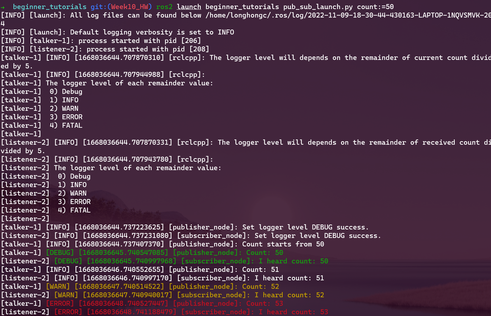
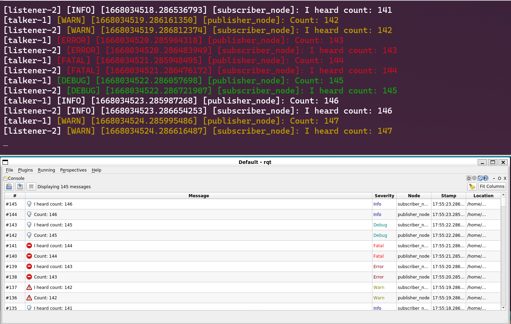

# Beginner Tutorials for ROS2
This repository contains following practices for ROS2
- [**Publisher subscriber**](#publisher-and-subscriber)  
- [**Services, launch file, and parameters**](#services-launch-file-and-parameters) 
### Table of contents
- [**Install**](#install)  
- [**Docs**](#docs) 
- [**Build**](#build) 
- [**Publisher subscriber**](#publisher-and-subscriber)  
- [**Services, launch file, and parameters**](#services-launch-file-and-parameters) 
- [**Code Format Check**](#code-format-check) 

## Dependencies
- ROS2 

### Testing Environment
- Ubuntu 20.04
- ROS2 Humble

## Install
Clone the repository to your ros2 workspace src folder
```
cd {ros2_ws}/src
git clone https://github.com/longhongc/beginner_tutorials.git
```

## Docs
Create doxygen docs with this command.
The doxygen docs will be export to the docs folder
```
cd {ros2_ws}
doxygen Doxyfile
```

## Build
Source your ros2 workspace  
Setup.bash can be .zsh, depends on your shell
```
cd {ros2_ws}
colcon build
source {ros2_ws}/install/setup.bash 
```


## Publisher and Subscriber
### Run
Switch to the git tag `ros_pub_sub_Release`
```
git checkout ros_pub_sub_Release
# build the code with the Build steps
```
Run publisher and listener on different terminals
```
ros2 run beginner_tutorials talker
ros2 run beginner_tutorials listener
```
### Result


## Services, launch file, and parameters
### Run
Switch to the git tag `Week10_HW_Release`
```
git checkout Week10_HW_Release
# build the code with the Build steps
```
Run launch file 
```
ros2 launch beginner_tutorials pub_sub_launch.py count:=50
```
The count argument can be modified to different number.  
If not provided, then the default count will start from 0.   

The count value can also be controlled by command line.
```
ros2 param describe /publisher_node count
ros2 param set /publisher_node count 100
ros2 param get /publisher_node
```
### Result
**launch file with command line argument**    
  
**Monitor through rqt_console**  
  

## Code Format Check
The code in this projects follows the guidline of cpplint and cppcheck.  
The output of cpplint and cppcheck is in results/cpplint_and_cppcheck. 
