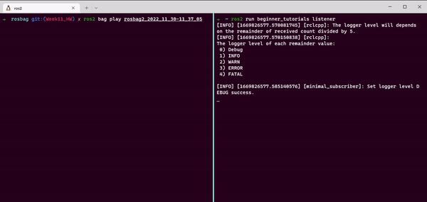

# Beginner Tutorials for ROS2
This repository contains following practices for ROS2
- [**Publisher subscriber**](#publisher-and-subscriber)  
- [**Services, launch file, and parameters**](#services-launch-file-and-parameters) 
- [**TF, Testing, and Rosbag**](#tf-testing-and-rosbag)
### Table of contents
- [**Install**](#install)  
- [**Docs**](#docs) 
- [**Build**](#build) 
- [**Publisher subscriber**](#publisher-and-subscriber)  
- [**Services, launch file, and parameters**](#services-launch-file-and-parameters) 
- [**TF, Testing, and Rosbag**](#tf-testing-and-rosbag)
  - [**TF**](#tf)
  - [**Testing**](#testing)
  - [**Rosbag**](#rosbag)
- [**Code Format Check**](#code-format-check) 

## Dependencies
- ROS2 

### Testing Environment
- Ubuntu 20.04
- ROS2 Humble

## Install
Clone the repository to your ros2 workspace src folder
```
cd {ros2_ws}/src
git clone https://github.com/longhongc/beginner_tutorials.git
```

## Docs
Create doxygen docs with this command.
The doxygen docs will be export to the docs folder
```
cd {ros2_ws}
doxygen Doxyfile
```

## Build
Source your ros2 workspace  
Setup.bash can be .zsh, depends on your shell
```
cd {ros2_ws}
colcon build --packages-select beginner_tutorials
source {ros2_ws}/install/setup.bash 
```


## Publisher and Subscriber
Switch to the git tag `ros_pub_sub_Release`
```
git checkout ros_pub_sub_Release
# build the code with the Build steps
```
### Run
Run publisher and listener on different terminals
```
ros2 run beginner_tutorials talker
ros2 run beginner_tutorials listener
```
### Result


## Services, launch file, and parameters

Switch to the git tag `Week10_HW_Release`
```
git checkout Week10_HW_Release
# build the code with the Build steps
```
### Run
Run launch file 
```
ros2 launch beginner_tutorials pub_sub_launch.py count:=50
```
The count argument can be modified to different number.  
If not provided, then the default count will start from 0.   

The count value can also be controlled by command line.
```
ros2 param describe /publisher_node count
ros2 param set /publisher_node count 100
ros2 param get /publisher_node
```
### Result
**launch file with command line argument**    
  
**Monitor through rqt_console**  
 

## TF, Testing, and Rosbag
Switch to the git tag `Week11_HW_Release`
```
git checkout Week11_HW_Release
# build the code with the Build steps
```
## TF
### Run
Start talker
```
ros2 run beginner_tutorials talker
```
### Result
Run tf echo command
```
ros2 run tf2_ros tf2_echo world talk
```
  

Export tf frames command
```
ros2 run tf2_tools view_frames
```
 

## Testing
### Run
First, [**build the code**](#build).  
Run the testing command
```
colcon test --event-handlers console_direct+ --packages-select beginner_tutorials
```
### Result
The test include default ROS2 code style check and a custom gtest for testing tf broadcast by talker.   
The full test result is in results/test_result.txt  


## Rosbag
### Run
Start the launch file.  
When the record arg is set to true, only talker will be running and ros2 bag will be recording the messages.   
The rosbag files will be saved to a timestamped folder in current directory.  
```
ros2 launch beginner_tutorials pub_sub_launch.py record:=true
```
Start the listener and wait for rosbag to be played
```
ros2 run beginner_tutorials listener
```
Play the bagfiles
```
ros2 bag play rosbag2*
```
#### Result



## Code Format Check
The code in this projects follows the guidline of cpplint and cppcheck.  
The output of cpplint and cppcheck is in results/cpplint_and_cppcheck. 
